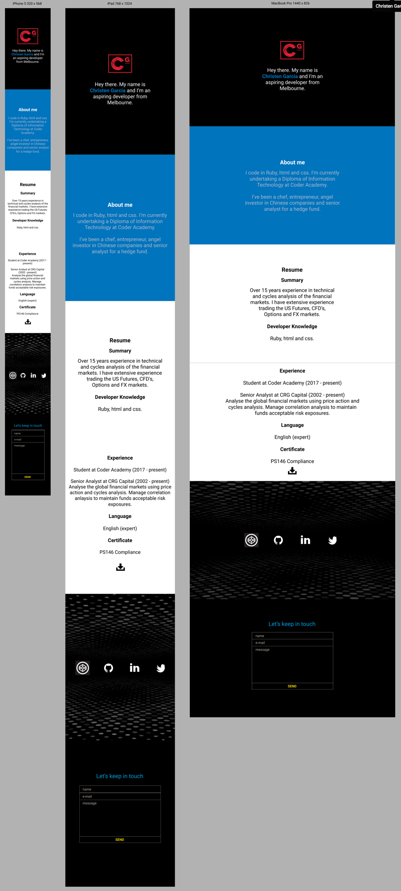

# Christen Garcia Portfolio Website
*For my website I wanted to have a very simplistic design, at the same time having a visual effect of a slideshow. I’ve created pages on about me, resume, links to social media and contact page.*

-------------------------------------------------------------------------------------

# Contents
  - Inspiration
  - Designs in Figma
  - Changes / Improvements
  - Challenges
  - Finished product
  - Resources

  -------------------------------------------------------------------------------------

# Inspiration

My first task in the project was to choose the base colours for my design and these were black, blue and grey. I used [Color Palettes](http://colorpalettes.net/color-palette-1851/ "Color Palettes") website to help me choose a combination of colours.

I collected pictures in [Pintrest](https://au.pinterest.com/christen_garcia/portfolio-project/) and saved many website links that inspired me. The most that resonated with me was [Adobe's](http://www.adobe.com/au/creativecloud/buy/students.html?promoid=65FN7X8B&mv=other "Adobe's Homepage") website.

The combination of black, blue and grey are basically the clothing colours that I wear on a daily basis. I thought the font colour red was a nice contrast from the dark backgrounds so I decided to make my logo red.

These are a collecton of simplistic looking websites that inspired me:

[Jun Lu](http://junlu.co/ "Jun Lu")

[Symbolset](https://symbolset.com/ "Symbolset")

[Hihayk](http://www.hihayk.com/ "Hayk")

[Simone Marcarino](http://simonemarcarino.com/ "Simone Marcarino")

While I was browsing for inspiration I came across Parallax and pagePiling designs. To adhere to my plan of a creating a simplistic looking website, I chose to use pagePiling. Page piling is basically similar to a slideshow so my Figma designs would have fixed single page dimensions. Having a simple design and fixed page dimensions I thought would be easy to replicate. 

-------------------------------------------------------------------------------------

# Designs in Figma

I decided to create a mobile, iPad and desktop design mockup in Figma. My site would mostly contain text so making it consistently responsive across all the various device sizes would be achievable.

I first created a mobile version in Figma and then extended that to iPad and desktop versions. I wanted a different colour for each page except my first and last page I chose black for symmetry. I also wanted to have a traditional look for my resume so I chose a plain white background with black text.

On my social media page I wanted to have some design contrast to the other plain colour web pages so I decided to have a textured black background with contrasting white icon links. 

The last thing I did was to create my logo on [Tailor Brands](https://www.tailorbrands.com/).

-------------------------------------------------------------------------------------

# Changes / Improvements

Once my Figma designs was finished I started coding. The only major change to my Figma design was to add an extra white page for my resume since pagePiling fixed page dimensions didn't accomodate for all my resume text to fit onto one page.  

I also decided to make my social media icons glow when you hover over them. Another addition I made from a recommendation from a fellow student was to put a resume download link. I chose a black download icon to keep inline with a traditional black text resume color scheme.

-------------------------------------------------------------------------------------

# Challenges

There were challenges right from the beginning since this was to be my first website to ever create. The design process for me was easier than the actual coding. Since my website was going to be simplistic looking, I was relyihg on the combination of colours to help achieve a professional look.  

Google search was my best friend throughout the entire project. My experience with html and css was very limited so about 90% of the time while coding, I was using google to help me. Every step of the way I was learning something new. I’ve never used jQuery before but I had my mind set on using pagePiling effect so I was really motivated to learn and get it to work.

-------------------------------------------------------------------------------------

# Finished Product

I’m really happy with my website. The design is exactly how I wanted it to be. I have suceeded in making the end product the same as the mockup designs.

[Christen Garcia Website](https://christengarcia.com)

-------------------------------------------------------------------------------------

# Resources

These are a list of websites I used to help me complete the project:

[pagePiling Tutorial](https://onextrapixel.com/how-to-create-a-beautiful-fullscreen-single-scrolling-page-like-huge-inc/ "pagePiling tutorial")

[stackoverflow](https://stackoverflow.com/ "stackoverflow")

[MDN web docs](https://developer.mozilla.org/en-US/ "MDN web docs")

[w3schools.com](https://www.w3schools.com/ "w3schools")

[Team Tree House](https://teamtreehouse.com/home "Team Tree House")

[W3C](https://validator.w3.org/ "W3C")

[css3test](http://css3test.com/ "css3test")

[fontawesome icons](http://fontawesome.io/icons/ "fontawesome icons")

[pixabay](https://pixabay.com "pixabay")

[codepen](https://codepen.com "codepen")

